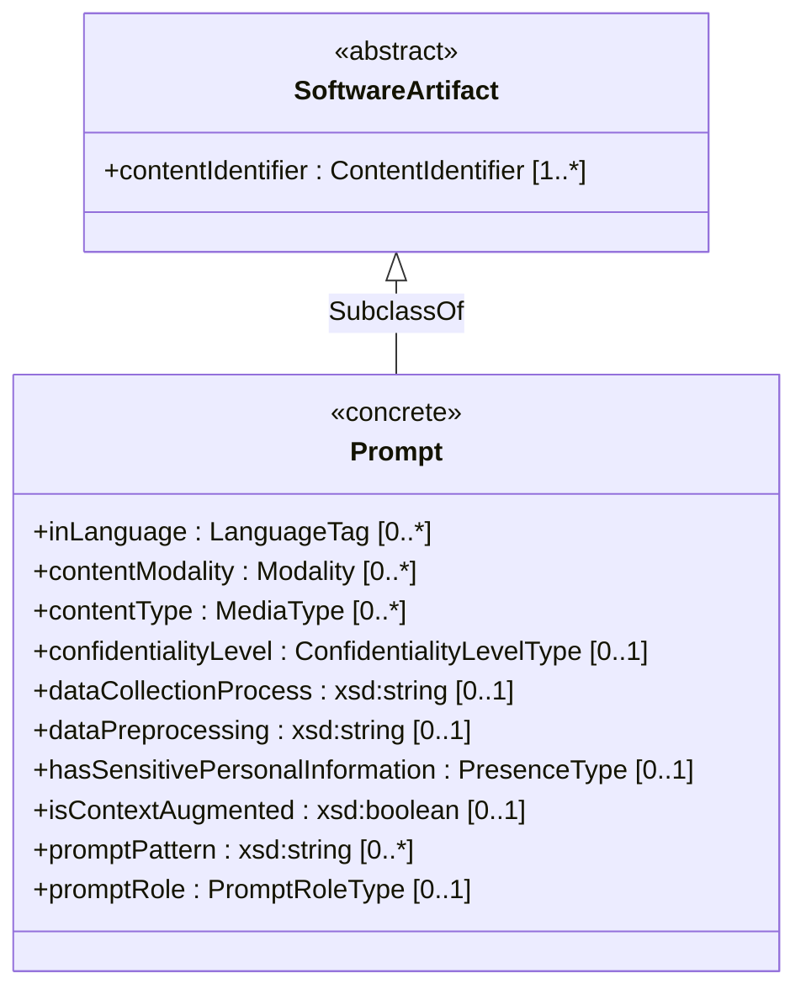

# Prompt Class — Properties Overview

This document visualizes all properties defined in `model/AI/Classes/Prompt.md`, grouped by the profile they originate from.

> **Legend:** properties highlighted in **bold** are used by `Prompt` — others are additional properties available in that profile.

---

## Prompt Property Sources

> **Green** = borrowed by `Prompt` &nbsp;|&nbsp; **Grey** = available in profile but not used

<table style="border-collapse:collapse; width:100%;">
  <tr>
    <th style="background:#1565c0;color:#fff;padding:10px 16px;text-align:center;font-size:15px;border-radius:6px 6px 0 0;">🔷 Core Profile</th>
    <th style="width:20px;border:none;background:none;"></th>
    <th style="background:#2e7d32;color:#fff;padding:10px 16px;text-align:center;font-size:15px;border-radius:6px 6px 0 0;">📊 Dataset Profile</th>
    <th style="width:20px;border:none;background:none;"></th>
    <th style="background:#b71c1c;color:#fff;padding:10px 16px;text-align:center;font-size:15px;border-radius:6px 6px 0 0;">🤖 AI Profile</th>
  </tr>
  <tr>
    <td style="vertical-align:top;border:2px solid #1565c0;padding:8px;border-radius:0 0 6px 6px;">
      <table style="width:100%;border-collapse:collapse;">
        <tr><td style="background:#1b5e20;color:#fff;font-weight:bold;padding:5px 10px;border-radius:4px;font-family:monospace;margin-bottom:4px;display:block;">inLanguage : LanguageTag</td></tr>
        <tr><td style="background:#1b5e20;color:#fff;font-weight:bold;padding:5px 10px;border-radius:4px;font-family:monospace;display:block;">contentModality : Modality</td></tr>
        <tr><td style="background:#1b5e20;color:#fff;font-weight:bold;padding:5px 10px;border-radius:4px;font-family:monospace;display:block;">contentType : MediaType</td></tr>
      </table>
    </td>
    <td style="border:none;background:none;"></td>
    <td style="vertical-align:top;border:2px solid #2e7d32;padding:8px;border-radius:0 0 6px 6px;">
      <table style="width:100%;border-collapse:collapse;border-spacing:0 4px;">
        <tr><td style="background:#1b5e20;color:#fff;font-weight:bold;padding:5px 10px;border-radius:4px;font-family:monospace;display:block;">dataCollectionProcess : xsd:string</td></tr>
        <tr><td style="background:#1b5e20;color:#fff;font-weight:bold;padding:5px 10px;border-radius:4px;font-family:monospace;display:block;">dataPreprocessing : xsd:string</td></tr>
        <tr><td style="background:#1b5e20;color:#fff;font-weight:bold;padding:5px 10px;border-radius:4px;font-family:monospace;display:block;">confidentialityLevel : ConfidentialityLevelType</td></tr>
        <tr><td style="background:#1b5e20;color:#fff;font-weight:bold;padding:5px 10px;border-radius:4px;font-family:monospace;display:block;">hasSensitivePersonalInformation : PresenceType</td></tr>
        <tr><td style="background:#37474f;color:#b0bec5;padding:5px 10px;border-radius:4px;font-family:monospace;display:block;">anonymizationMethodUsed : xsd:string</td></tr>
        <tr><td style="background:#37474f;color:#b0bec5;padding:5px 10px;border-radius:4px;font-family:monospace;display:block;">datasetAvailability : DatasetAvailabilityType</td></tr>
        <tr><td style="background:#37474f;color:#b0bec5;padding:5px 10px;border-radius:4px;font-family:monospace;display:block;">datasetNoise : xsd:string</td></tr>
        <tr><td style="background:#37474f;color:#b0bec5;padding:5px 10px;border-radius:4px;font-family:monospace;display:block;">datasetSize : xsd:nonNegativeInteger</td></tr>
        <tr><td style="background:#37474f;color:#b0bec5;padding:5px 10px;border-radius:4px;font-family:monospace;display:block;">datasetType : DatasetType</td></tr>
        <tr><td style="background:#37474f;color:#b0bec5;padding:5px 10px;border-radius:4px;font-family:monospace;display:block;">datasetUpdateMechanism : xsd:string</td></tr>
        <tr><td style="background:#37474f;color:#b0bec5;padding:5px 10px;border-radius:4px;font-family:monospace;display:block;">intendedUse : xsd:string</td></tr>
        <tr><td style="background:#37474f;color:#b0bec5;padding:5px 10px;border-radius:4px;font-family:monospace;display:block;">knownBias : xsd:string</td></tr>
        <tr><td style="background:#37474f;color:#b0bec5;padding:5px 10px;border-radius:4px;font-family:monospace;display:block;">sensor : xsd:string</td></tr>
      </table>
    </td>
    <td style="border:none;background:none;"></td>
    <td style="vertical-align:top;border:2px solid #b71c1c;padding:8px;border-radius:0 0 6px 6px;">
      <table style="width:100%;border-collapse:collapse;">
        <tr><td style="background:#1b5e20;color:#fff;font-weight:bold;padding:5px 10px;border-radius:4px;font-family:monospace;display:block;">isContextAugmented : xsd:boolean</td></tr>
        <tr><td style="background:#1b5e20;color:#fff;font-weight:bold;padding:5px 10px;border-radius:4px;font-family:monospace;display:block;">promptPattern : xsd:string</td></tr>
        <tr><td style="background:#1b5e20;color:#fff;font-weight:bold;padding:5px 10px;border-radius:4px;font-family:monospace;display:block;">promptRole : PromptRoleType</td></tr>
        <tr><td style="background:#37474f;color:#b0bec5;padding:5px 10px;border-radius:4px;font-family:monospace;display:block;">autonomyType : AutonomyTypeType</td></tr>
        <tr><td style="background:#37474f;color:#b0bec5;padding:5px 10px;border-radius:4px;font-family:monospace;display:block;">domain : xsd:string</td></tr>
        <tr><td style="background:#37474f;color:#b0bec5;padding:5px 10px;border-radius:4px;font-family:monospace;display:block;">energyConsumption : EnergyConsumption</td></tr>
        <tr><td style="background:#37474f;color:#b0bec5;padding:5px 10px;border-radius:4px;font-family:monospace;display:block;">energyQuantity : xsd:decimal</td></tr>
        <tr><td style="background:#37474f;color:#b0bec5;padding:5px 10px;border-radius:4px;font-family:monospace;display:block;">energyUnit : EnergyUnitType</td></tr>
        <tr><td style="background:#37474f;color:#b0bec5;padding:5px 10px;border-radius:4px;font-family:monospace;display:block;">finetuningEnergyConsumption : EnergyConsumptionDescription</td></tr>
        <tr><td style="background:#37474f;color:#b0bec5;padding:5px 10px;border-radius:4px;font-family:monospace;display:block;">hyperparameter : xsd:string</td></tr>
        <tr><td style="background:#37474f;color:#b0bec5;padding:5px 10px;border-radius:4px;font-family:monospace;display:block;">inferenceEnergyConsumption : EnergyConsumptionDescription</td></tr>
        <tr><td style="background:#37474f;color:#b0bec5;padding:5px 10px;border-radius:4px;font-family:monospace;display:block;">informationAboutApplication : xsd:string</td></tr>
        <tr><td style="background:#37474f;color:#b0bec5;padding:5px 10px;border-radius:4px;font-family:monospace;display:block;">informationAboutTraining : xsd:string</td></tr>
        <tr><td style="background:#37474f;color:#b0bec5;padding:5px 10px;border-radius:4px;font-family:monospace;display:block;">limitation : xsd:string</td></tr>
        <tr><td style="background:#37474f;color:#b0bec5;padding:5px 10px;border-radius:4px;font-family:monospace;display:block;">metric : xsd:string</td></tr>
        <tr><td style="background:#37474f;color:#b0bec5;padding:5px 10px;border-radius:4px;font-family:monospace;display:block;">metricDecisionThreshold : xsd:string</td></tr>
        <tr><td style="background:#37474f;color:#b0bec5;padding:5px 10px;border-radius:4px;font-family:monospace;display:block;">modelDataPreprocessing : xsd:string</td></tr>
        <tr><td style="background:#37474f;color:#b0bec5;padding:5px 10px;border-radius:4px;font-family:monospace;display:block;">modelExplainability : xsd:string</td></tr>
        <tr><td style="background:#37474f;color:#b0bec5;padding:5px 10px;border-radius:4px;font-family:monospace;display:block;">safetyRiskAssessment : SafetyRiskAssessmentType</td></tr>
        <tr><td style="background:#37474f;color:#b0bec5;padding:5px 10px;border-radius:4px;font-family:monospace;display:block;">standardCompliance : xsd:string</td></tr>
        <tr><td style="background:#37474f;color:#b0bec5;padding:5px 10px;border-radius:4px;font-family:monospace;display:block;">trainingEnergyConsumption : EnergyConsumptionDescription</td></tr>
        <tr><td style="background:#37474f;color:#b0bec5;padding:5px 10px;border-radius:4px;font-family:monospace;display:block;">typeOfModel : xsd:string</td></tr>
        <tr><td style="background:#37474f;color:#b0bec5;padding:5px 10px;border-radius:4px;font-family:monospace;display:block;">useSensitivePersonalInformation : PresenceType</td></tr>
      </table>
    </td>
  </tr>
</table>

---

## Class Hierarchy

---

## Properties Reference Table

| # | Property | Profile | Type | minCount | maxCount |
|---|---|---|---|:---:|:---:|
| 1 | `inLanguage` | `/Core` | `LanguageTag` | 0 | ∞ |
| 2 | `contentModality` | `/Core` | `Modality` | 0 | ∞ |
| 3 | `contentType` | `/Core` | `MediaType` | 0 | ∞ |
| 4 | `dataCollectionProcess` | `/Dataset` | `xsd:string` | 0 | 1 |
| 5 | `dataPreprocessing` | `/Dataset` | `xsd:string` | 0 | 1 |
| 6 | `confidentialityLevel` | `/Dataset` | `ConfidentialityLevelType` | 0 | 1 |
| 7 | `hasSensitivePersonalInformation` | `/Dataset` | `PresenceType` | 0 | 1 |
| 8 | `isContextAugmented` | `/AI` | `xsd:boolean` | 0 | 1 |
| 9 | `promptPattern` | `/AI` | `xsd:string` | 0 | ∞ |
| 10 | `promptRole` | `/AI` | `PromptRoleType` | 0 | 1 |

### External Property Restrictions (inherited from `/Software/SoftwareArtifact`)

| Property | Namespace | Type | minCount |
|---|---|---|:---:|
| `contentIdentifier` | `/Software` | `ContentIdentifier` | 1 |
