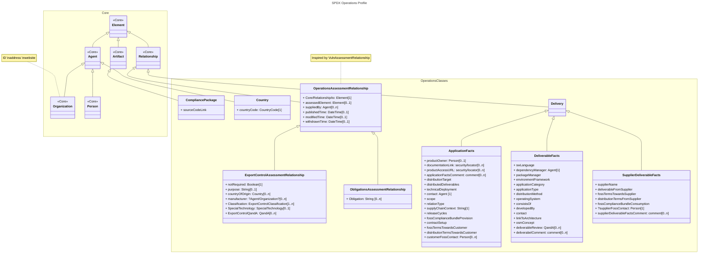
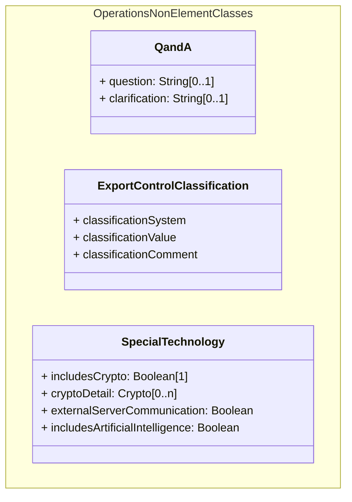

# Classes draft
## main draft

## nonElementClasses

## Enumerations
- CountryCode
    - Enumeration, external provider (official country code)
- classificationSystem
    - Enumeration, possibly external provider

# Notes

# future steps
2. finish base line description in Mermaid notation
3. add class descriptions in the official markdown notation, leave 'Metadata', 'Properties', etc. in the Mermaid document for now.
    - add folders for 'Classes', 'Properties', ' Vocabularies'
4. translate class definitions into official markdown notation
5. Add Draw.io visualization

# Questions
1. How to do enumerations with sources from external providers?
    - Where to define enumeration?
    - how to link to external lists?
2. is the Draw.io renedering of the profiles generated by script or manually?

# Homework
- Marcel: start discussion on fossComplianceBundleProvision (with source code provision, etc.)
- Ummo: talk to Alexios (?) about using 'connecting the dots' for Operations Profile draft work
- Ummo: Questions 1 & 2
- Matthew: Ask Gary about adding a slack channel for 'Operations' and for DOs and DON'Ts in setting up the markdown description.
