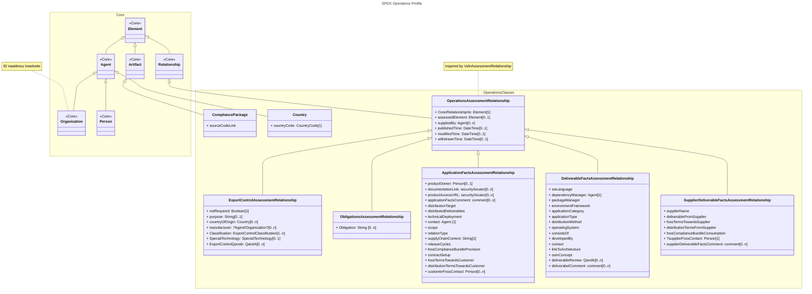
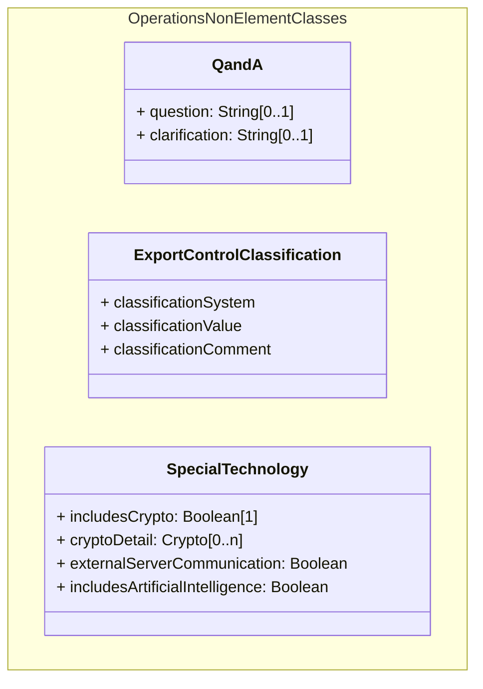

# Classes draft
## main draft

## nonElementClasses

## Enumerations
- CountryCode
    - Enumeration, external provider (official country code)
- classificationSystem
    - Enumeration, possibly external provider

# Notes
- remove 'supplierFossContact' from 'SupplierDeliverableFactsAssessmentRelationship'?
    - this is probably better tracked in CRM and linked to 'Agent' class supplier information 
- 'Delivery' as its own relationship rather than part of an assessment?