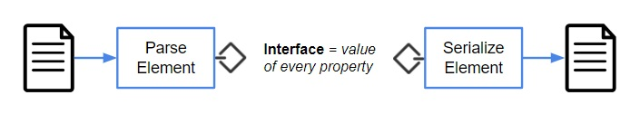
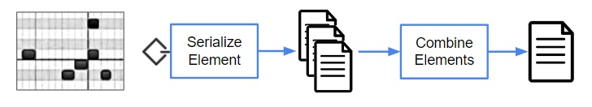

# SPDX v3 Serialization

The SPDX logical model defines meaning, relationships and shapes of the SPDX element graph, but the same
information can be serialized into many different byte sequences.  A physical data model (concrete schema)
specifies logical element serialization using a specific data format, while an information model
(abstract schema) specifies logical element serialization using any data format.  Reading information
into applications from multiple formats allows instances to be compared; writing it to multiple formats
allows it to be converted between formats without loss.

### Serialization Concepts

Information exists in the minds of users (producers and consumers), in the state of applications running
on systems, and in the data exchanged among applications.
Serialization converts application information into byte sequences (a.k.a. protocol data units, messages,
payloads, information exchage packages) that can be validated, communicated and stored.
De-serialization parses payloads back into application state.
Serialization is not a goal in and of itself, it is the mechanism by which applications exchange information
in order to make it available to users.


Serialization should be:
1) **lossless**, so that information is not modified in transit and all applications have the identical information
2) **transparent**, so that information is unaffected by whether or how it has been serialized;
users should not know or care.

Shannon's information theory defines the relationship between information and serialization (coding).
Mathematicians characterize conditions applied to a mechanism as *necessary* and/or *sufficient*:
a serialization that omits necessary data loses information, one that uses more data than sufficient
conveys no extra information.
TV bartender/philosopher Ted Danson put it most succinctly: a necessary and sufficient serialization
mechanism has "everything you need and nothing you don't."

### SPDX v3 Information

The classes of a logical model are either referenceable or datatypes.
* A **datatype** class is known only by its value.
Two instances of the class are equivalent if and only if every property in the class is equal.
* A **referenceable** class has a unique identifier (primary key) and each instance is known by its id.
Two instances of the class are considered equivalent if and only if their ids are equal.
If only a single value can correspond to an id, the class is a *mapping* and colliding values
are treated as an error.

SPDX v3 organizes all of its information into a single referenceable "Element" class - all logical
state in SPDX exists as element values, and each element exists independently of all other elements.

Every information model consists solely of datatype classes, where properties have syntax but not behavior,
and no special significance is attached to property names such as "id" and "type".
Referenceable classes in the SPDX logical model are translated to datatypes where "id" is nothing more
than a property of type IRI. SPDX elements can be serialized as:
* lists where each element has an IRI property, or
* maps where each element has an IRI key.

Both serializations convey the identical information; the information model specifies which serialization to use.

Figure 2 illustrates a set of elements from the information perspective:


1) Each element (black dot) has a unique id, type, and creation information. Serialization examples should show 
realistic unique ids; current examples do not.
2) Individual elements are ordered by creation date from oldest at the bottom to newest at the top.  One or more
elements can be created at the same time, shown in a horizontal row.  Position within a row does not signify anything.
3) Although elements are logically related by graph edges, at the information layer references are just property
values within each element.
4) Elements can exist in an application without ever being serialized. But to communicate between applications,
one or more elements are serialized into *payloads*, illustrated as the red horizontal bar at t=5. The payload is
not an element, it is just a sequence of bytes carrying an arbitrary set of elements, equivalent to the
identical elements carried in a zip file.
5) Serialization is causal; the payload created at t=5 cannot contain any elements created after it (t>5).
6) A payload may contain elements with the same creation time as the payload, and may also contain
previously-created elements such as the red element created at t=3 and two red elements created at t=1.
In the figure, the payload created at t=5 contains seven elements with three different timestamps.
7) Elements in a payload may have properties that are unique IDs of elements not carried in the payload,
such as the IDs of the green elements created at t=2 and t=4.

Although it is possible to define nested serialization structures, there are practical disadvantages:
1) nesting can be arbitrarily deep
2) if a nesting limit (e.g., max 1 level deep) is declared, the identical element has a different value
when serialized at level 1 or 2
3) if one element is nested within multiple other elements, multiple copies of the same data are carried in the payload 
4) if elements are nested, they have different serialized values than when serialized individually
5) if elements are nested, rules for property inheritance must be defined, resulting in even more serialized
variants of the same element

For these reasons, it is more scalable, understandable and efficient to serialize all elements in a payload
separately, without nesting or alternate representations.

### Logical Value Interface

The logical value of an element is an *interface* - an answer to the question "what is the value of each
property defined in the logical model". For convenience, logical values are displayed as data rather than
a set of questions and answers, so when looking at examples the distinction between logical values and
physical data must be kept in mind.
A serializer produces a single-element payload from the logical value of an element; a de-serializer parses
an element's logical value from the payload.
For each supported data format, a serialization specification must define the serialized value of an element
for each element type in the logical model:



To serialize a group of logical elements, each element is serialized individually and the individual data
items are combined into an "SPDX file". The easiest combining method is concatenation, but combining
should also reduce the size of the combined value. Any generic lossless compression algorithm
(e.g., zip, gzip, 7zip) will work, but SPDX defines a trivial element-specific combiner that:
* performs namespace prefix substitution for element IDs
* supplies default values for common creation-related properties
* yields a combined file in the same format (JSON) as the individual elements



To deserialize an SPDX file, the combined value is decompressed then split into individual
data items that are parsed into logical element values.

### SPDX Serialization Examples

The SPDX v3 model diagram includes some JSON examples, but their purpose is to illustrate and
develop the logical model, not specify how to construct and validate a byte sequence.
When serialization specifications are defined, examples are needed to illustrate and develop them.

Figure 3 shows a JSON example from the diagram as of 12/19/2022:


This example contains three elements in a nested structure: an SBOM (null-sbom), a Package
(spdx-tools-3.0.1), and a Person (iamwillbar). The first task is to determine the logical values of these
three elements. 

The logical values of these elements are:

**Package:**
```json
{
  "id": "urn:spdx.dev:spdx-tools-3.0.1",
  "type": {
    "package": {
      "packagePurpose": ["application"],
      "downloadLocation": "https://spdx.dev/downloads/spdx-tools-3.0.1.tgz",
      "homePage": "https://spdx.dev/tools.3.0",
      "originator": ["urn:spdx.dev:project"]
    }
  },
  "externalIdentifier": [
    {"type": "purl", "identifier": ""},
    {"type": "cpe_2.2", "identifier": ""}
  ],
  "verifiedUsing": [{"hash": {"sha256": "14a657a7118a333cc1fdc6af05071a59cda067fd11130d4ee5d6d47c26e7863f"}}],
  "creator": ["urn:spdx.dev:iamwillbar"],
  "created": "2022-05-02T20:28:00.000Z",
  "specVersion": "3.0",
  "profile": ["core", "software"],
  "dataLicense": "CC0-1.0"
}
```
**Person:**
```json
{
  "id": "urn:spdx.dev:iamwillbar",
  "type": {
    "person": {
      "identifiedBy": [
        {"email": "willbar@microsoft.com"},
        {"account": {"authority": "github.com", "localId": "iamwillbar"}}
      ]
    }
  },
  "name": "William Bartholomew",
  "creator": ["urn:spdx.dev:iamwillbar"],
  "created": "2022-05-02T20:28:00.000Z",
  "specVersion": "3.0",
  "profile": ["core"],
  "dataLicense": "CC0-1.0"
}
```
The `person` element illustrates a problem with the logical model that can be resolved by adding
an `identifiedBy` property to the Identity type. For the purpose of illustrating serialization, assume that the
problem has been resolved in this manner.

**Sbom:**
```json
{
  "id": "urn:spdx.dev:null-sbom",
  "type": {
    "sbom": {
      "element": [
        "urn:spdx.dev:iamwillbar",
        "urn:spdx.dev:spdx-tools-3.0.1",
        "urn:spdx.dev:project",
        "urn:spdx.dev:doc"
      ],
      "import": [
        {
          "externalId": "urn:spdx.dev:project",
          "verifiedUsing": {"hash": {"sha256": "14a657a7118a333cc1fdc6af05071a59cda067fd11130d4ee5d6d47c26e7863f"}},
          "locationHint": "https://spdx.dev/projects/v1.0.json"
        },
        {
          "externalId": "urn:spdx.dev:doc",
          "verifiedUsing": {"hash": {"sha256": "14a657a7118a333cc1fdc6af05071a59cda067fd11130d4ee5d6d47c26e7863f"}},
          "locationHint": "https://spdx.dev/docs/v1.0.json"
        }
      ]
    }
  },
  "creator": ["urn:spdx.dev:iamwillbar"],
  "created": "2022-05-02T20:28:00.000Z",
  "specVersion": "3.0",
  "profile": ["core", "software"],
  "dataLicense": "CC0-1.0"
}

```
Note that every JSON structure has both leaf-path (RFC 6901) and hierarchical representions. The two represent
identical values and can be converted back and forth without any semantic knowledge.
For example, the path representation of the Sbom element is:

**Sbom (path):**
```json
{
  "id": "urn:spdx.dev:null-sbom",
  "type/sbom/element/0": "urn:spdx.dev:iamwillbar",
  "type/sbom/element/1": "urn:spdx.dev:spdx-tools-3.0.1",
  "type/sbom/element/2": "urn:spdx.dev:project",
  "type/sbom/element/3": "urn:spdx.dev:doc",
  "type/sbom/import/0/externalId": "urn:spdx.dev:project",
  "type/sbom/import/0/verifiedUsing/hash/sha256": "14a657a7118a333cc1fdc6af05071a59cda067fd11130d4ee5d6d47c26e7863f",
  "type/sbom/import/0/locationHint": "https://spdx.dev/projects/v1.0.json",
  "type/sbom/import/1/externalId": "urn:spdx.dev:doc",
  "type/sbom/import/1/verifiedUsing/hash/sha256": "14a657a7118a333cc1fdc6af05071a59cda067fd11130d4ee5d6d47c26e7863f",
  "type/sbom/import/1/locationHint": "https://spdx.dev/docs/v1.0.json",
  "creator/0": "urn:spdx.dev:iamwillbar",
  "created": "2022-05-02T20:28:00.000Z",
  "specVersion": "3.0",
  "profile/0": "core",
  "profile/1": "software",
  "dataLicense": "CC0-1.0"
}
```
Because they represent identical values, choosing a logical represenation is a matter of taste;
one or the other should be chosen for documentation purposes. The logical representation does not affect
the serialization format, although the same alternatives are available for the serialization spec.

**SpdxDocument:**

An SpdxDocument element describes the set of elements serialized into a payload. In this example it lists
the package, person and sbom elements shown above, plus its own element ID if it is included in the payload.
The SpdxDocument element for the payload in Figure 2 would list the four elements created at t=5 plus one
element created at t=3 plus two elements created at t=1.
```json
{
  "id": "urn:spdx.dev:docs/sdoc",
  "type": {
    "spdxDocument": {
      "namespace": "urn:spdx.dev:",
      "element": [
        "urn:spdx.dev:null-sbom",
        "urn:spdx.dev:iamwillbar",
        "urn:spdx.dev:spdx-tools-3.0.1",
        "urn:spdx.dev:docs/sdoc"
      ],
      "downloadLocation": "https://spdx.dev/docs/sdoc-v1.0.json"
    }
  },
  "verifiedUsing": [{"hash": {"sha256": "14a657a7118a333cc1fdc6af05071a59cda067fd11130d4ee5d6d47c26e7863f"}}],
  "created": "2022-05-02T20:28:00.000Z",
  "creator": ["urn:spdx.dev:iamwillbar"],
  "specVersion": "3.0",
  "profile": ["core"],
  "dataLicense": "CC0-1.0"
}

```

**Payload:**

The [Payloads](Payloads) folder contains example SPDX files with default properties and element values.
For this example, the payload looks like:

```json
{
  "namespace": "urn:spdx.dev:",
  "created": "2022-05-02T20:28:00.000Z",
  "creator": ["iamwillbar"],
  "specVersion": "3.0",
  "profile": ["core"],
  "dataLicense": "CC0-1.0",
  "elements": [
    {"id": "null-sbom", "type": {}},
    {"id": "iamwillbar", "type": {}},
    {"id": "spdx-tools-3.0.1", "type": {}},
    {"id": "docs/sdoc", "type": {}}
  ],
  "spdxDocumentId": "docs/sdoc"
}
```

## References

[Information Exchange Context](https://niem.github.io/reference/iepd/)

[Ted Danson](https://www.youtube.com/watch?v=BjeLEoc8Kjg)

[JSON Pointer](https://datatracker.ietf.org/doc/rfc6901/)