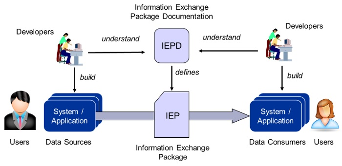
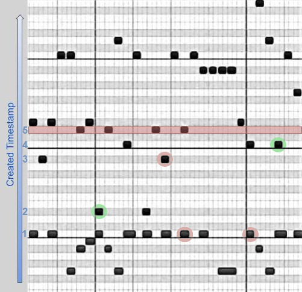
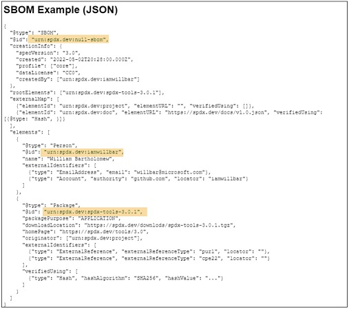
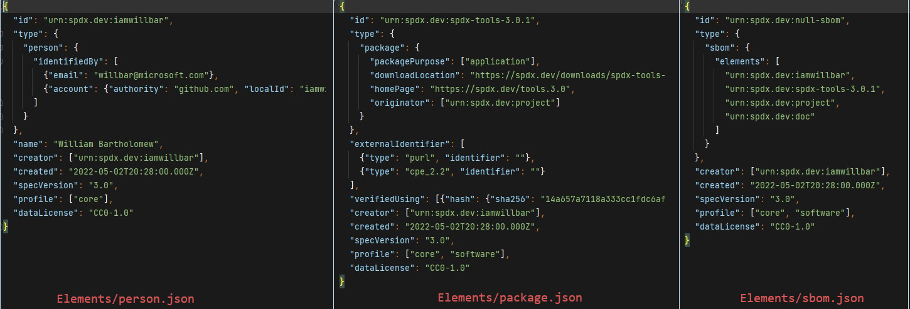
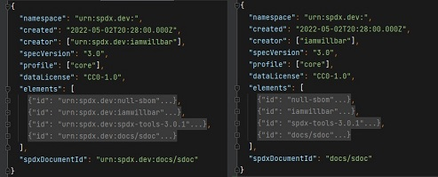
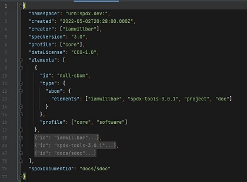

# SPDX v3 Serialization

The SPDX logical model defines meaning, relationships and shape of the SPDX element graph, but the same
information can be serialized into many different byte sequences.  A physical data model (concrete schema)
specifies logical element serialization using a specific data format, while an information model
(abstract schema) specifies logical element serialization using any data format.  Reading information
into applications from multiple formats allows instances to be compared; writing it to multiple formats
allows it to be converted between formats without loss.

### Serialization Concepts

Information exists in the minds of users (producers and consumers), in applications running on the systems they use,
and in the data exchanged among systems.
Serialization converts application information into byte sequences (messages, payloads, information exchage packages)
that can be validated, communicated and stored.
De-serialization parses payloads back into application state.
Serialization is not a goal in and of itself, it is the mechanism by which applications exchange information
in order to make it available to users.

Serialization should be:
1) **lossless**, so that information is not modified in transit and all applications have the identical information
2) **transparent**, so that information is unaffected by how or if it has been serialized; users should not know or care.

Shannon's information theory defines the relationship between information and serialization (coding).
Mathematicians characterize conditions applied to a mechanism as *necessary* and/or *sufficient*:
a serialization that omits necessary data loses information, one that uses more data than sufficient
conveys no extra information.
TV bartender/philosopher Ted Danson put it most succinctly: a necessary and sufficient serialization
mechanism has "everything you need and nothing you don't."

### SPDX v3 Information

SPDX v3 organizes information into a single uniform "Element" class - every bit of logical state modeled by SPDX
exists as instances of element subclasses (element itself is abstract), and each element exists
independently of all other elements. Figure 2 illustrates a set of elements from the information perspective:
1) Each element (black dot) has a unique id, type, and creation information. Serialization examples should show 
realistic unique ids; current examples do not.
2) Individual elements are ordered by creation date from oldest at the bottom to newest at the top.  One or more
elements can be created at the same time, shown in a horizontal row.  Position within a row does not signify anything.
3) Although elements are logically related by graph edges, at the information layer relationships are just property
values within each element.
4) Elements can exist in an application without ever being serialized. But to communicate between applications,
one or more elements are serialized into *payloads*, illustrated as the red horizontal bar at t=5.
5) Serialization must be causal; the payload created at t=5 cannot contain any elements created after it (t>5).
6) A payload may contain elements with the same creation time as the payload, and may also contain
previously-created elements such as the red element created at t=3 and two red elements created at t=1.
In the figure, the payload created at t=5 contains seven elements with three different timestamps.
7) Elements in a payload may have properties that are unique IDs of elements not contained in the payload,
such as the IDs of the green elements created at t=2 and t=4. Those properties have no special meaning at the
information layer, they are just ID values to be serialized.

### SPDX Serialization Examples

The SPDX v3 model diagram includes some JSON examples, but they are used to illustrate and
develop the logical model, not specify how to construct and validate a byte sequence
to represent a set of logical values.
Figure 3 shows a JSON example from the diagram as of 12/19/2022:

This example contains three elements in a nested structure: an SBOM (null-sbom), a Package
(spdx-tools-3.0.1), and a Person (iamwillbar). The first task is to determine the logical values of these
three elements. Note that "logical value" is an "interface" - an answer to the question
"what is the value of each property defined in the logical model", not a data structure. But the
answers to those questions are displayed as data, so the distinction between logical values and
physical data must be kept in mind.

Figure 4 shows the logical value of each of the elements from the example:

The `person` element illustrates a problem with the logical model that can be resolved by adding
an `identifiedBy` property to the Identity type. For serialization purposes, assume that the
problem has been resolved in some manner.

Figure 5 shows the same three elements serialized individually without nesting, along with an
SpdxDocument containing information about the serialized payload.
On the left is the expanded version of the payload with no space optimization, and on the right
is the same payload optimized using namespace-relative element IDs and creation property defaults.
The payload structure is simple, containing just a set of optimization-related properties and the
set of independent (non-nested) element values.

Figure 4 shows the example SBOM element (null-sbom), greatly simplified from the nested version.
It includes just the element IDs of the SBOM and a profile list that overrides the default.
Two IDs (Person "iamwillbar" and Package "spdx-tools-3.0.1") are actual elements included
in the payload, and the other two ("project" and "doc") are IDs assigned to external data
objects for which no elements exist.

Figure 6 shows the example Person element.

## References

[iepd](https://niem.github.io/reference/iepd/)

[danson](https://www.youtube.com/watch?v=BjeLEoc8Kjg)