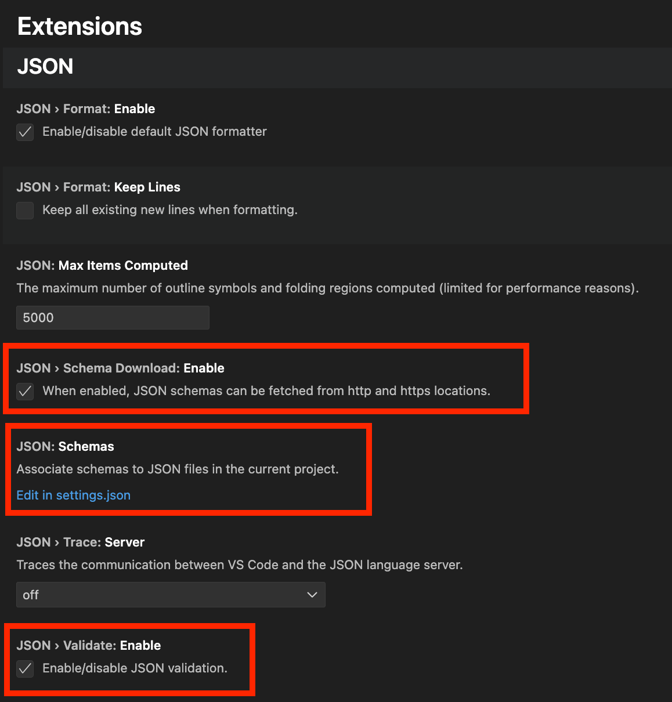
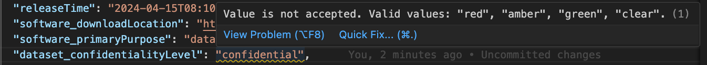

# Validating SPDX 3 JSON-LD documents

There are two mechanisms for validating SPDX 3 JSON-LD documents; validating
the structure against the JSON Schema, and validating the semantic against the
SHACL model.

These two different mechanisms serve validate the document in different ways,
so it is recommended to do both types of validation to ensure that your
documents are correct.

Validation of documents can be done locally using the methods described below.

## Validating the structure against the JSON Schema

SPDX 3 JSON-LD documents adhere to a JSON Schema to ensure that they can be
parsed as either RDF documents using a full RDF parsing library, or as more
simplistic JSON documents using a basic JSON parser. Validating a document
against the JSON schema requires installing a tool that can do the validation.

JSON Schema validation is designed to ensure that a document is structurally
conformant to the SPDX 3 spec (that is, all the proper fields are used and have
the correct types), but it is unable to ensure that a document is semantically
correct (that is that everything is used in the correct way).

There are a few tools that are known to work, which are described below

### ajv

[ajv](https://ajv.js.org/) is a Node.js implementation of a JSON schema
validator. It is the recommended validation tool as it has been shown to be
fast and helpful in its error messages. To get started, the tool must first be
installed from NPM:

```shell
npm install --global ajv-cli
```

Unfortunately, `ajv` does not allow referencing a schema from a URL, so it must
first be downloaded locally in order to do validation:

```shell
wget -O spdx-3-schema.json https://spdx.org/schema/3.0.0/spdx-json-schema.json
```

Validation of a document can now be done with the command:

```shell
ajv validate --spec=draft2020 -s spdx-3-schema.json -d <DOCUMENT>
```

### check-jsonschema

[check-jsonschema](https://check-jsonschema.readthedocs.io/en/stable/) is a
Python based command line tool to validate a JSON schema built on top of the
[jsonschema](https://python-jsonschema.readthedocs.io/en/stable/) library. It
is not as fast as `ajv` (especially for large documents), but may be useful in
places where using NPM is not desired, or if you want to be able to reference
the schema directly from a URL.

To install the tool, use pip:

```shell
python3 -m pip install --user check-jsonschema
```

`check-jsonschema` can reference the schema directly from its URL, so there is
no need to download it first. To validate a document, run the command:

```shell
check-jsonschema -v --schemafile https://spdx.org/schema/3.0.0/spdx-json-schema.json <DOCUMENT>
```

## Validating the semantic against the SHACL model

The SPDX 3 SHACL model is designed to validate that a document is semantically
valid, that is that the way objects and properties are used actually conforms
to SPDX 3. However, the SHACL model cannot validate the structure of a
document, since there are many different ways of encoding an RDF document,
many of which are not allowed by SPDX 3.

There is currently only one preferred tool for validating an SPDX 3 document
against the model:

### pyshacl

[pyshacl](https://github.com/RDFLib/pySHACL/) is a Python based SHACL validator
built on top of [rdflib](https://rdflib.readthedocs.io/en/stable/). It can be
install using pip:

```shell
python3 -m pip install --user pyshacl
```

`pyshacl` can reference the SPDX 3 SHACL model directly from the URL. This
means a document can be validated using the command:

```shell:
pyshacl \
    --shacl https://spdx.org/rdf/3.0.0/spdx-model.ttl \
    --ont-graph https://spdx.org/rdf/3.0.0/spdx-model.ttl \
    <DOCUMENT>
```

*NOTE:* pyshacl will produce warnings if you are referencing SpdxIds that are
outside of your document, as it cannot understand the use of `import` in
`SpdxDocument`. For the time being, you will need to manually verify these
references and ignore the warnings.

## Enable real-time validation during editing

Some code editors offer real-time validation of JSON against a schema as you
edit. This feature is particularly handy for quickly identifying the location
of errors or warnings.

### Real-time validation in Visual Studio Code

For instance, in Visual Studio Code, you can
[enable JSON validation](https://code.visualstudio.com/docs/languages/json#_intellisense-and-validation)
by navigating to `Settings` > `Extensions` and activate the
`JSON › Validate: Enable` setting by ticking the checkbox.



Next, edit your `settings.json` file and add the SPDX JSON Schema
(`https://spdx.org/schema/3.0.0/spdx-json-schema.json`)
to the `json.schemas` array.

```json
"json.schemas": [
  {
    "fileMatch": [
      "*.spdx3.json"
    ],
    "url": "https://spdx.org/schema/3.0.0/spdx-json-schema.json"
  }
]
```

Once enabled, the editor will perform real-time validation and display any
errors.

To illustrate, the screenshot below shows the editor highlighting an
unacceptable value for `dataset_confidentialityLevel`.
Only values from the predefined list are allowed.



## Common errors

Here are some common errors worth looking into if an SPDX JSON-LD fails validation.

### Serialized names

Serialized names take the form of either `profilename_ClassName` or
`profilename_propertyName`.  The prefix `profilename_` is derived from the name
of the Profile and is always written in lowercase letters.
There is an exception for the `Core` Profile, where serialized names omit the
prefix entirely.

For example,

- `dataset_datasetType` for a `datasetType` Property in the `Dataset` Profile
- `expandedlicensing_CustomLicense` for a `CustomLicense` Class in the
  `ExpandedLicensing` Profile
- `Person` for a Class `Person` in the `Core` Profile (no prefix)

### Cardinality

A property with a cardinality greater than 1 must be represented as an array in
JSON, regardless of the actual number of values it holds.
