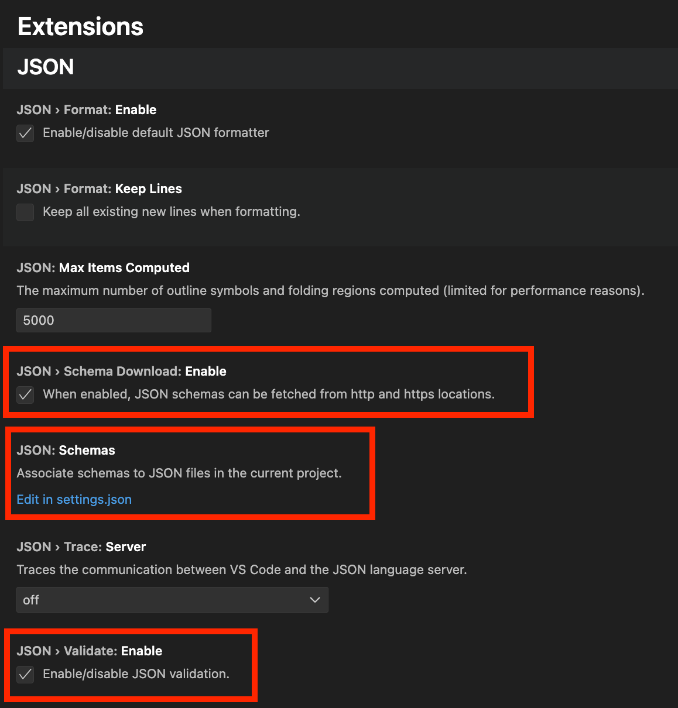
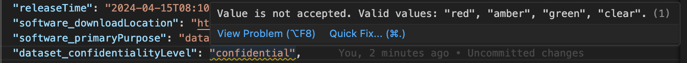
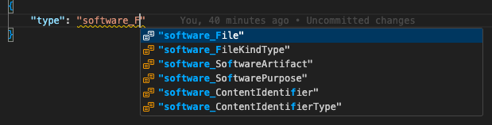

# Validating SPDX 3 JSON documents

> The SPDX 3 JSON format is a strict subset of JSON-LD.
> It requires data to be serialized according to the defined serialization
> specification and validated against the SPDX 3 JSON Schema.
> It may be parsed – not serialized – using standard JSON-LD libraries.

There are two mechanisms for validating SPDX 3 JSON documents:
validating the structure against the JSON Schema, and
validating the semantics against the SHACL model.

These two different mechanisms serve validate the document in different ways,
so it is recommended to do both types of validation to ensure that your
documents are correct.

## Table of contents

- [Background](#background)
  - [Validating the structure against the JSON Schema](#validating-the-structure-against-the-json-schema)
  - [Validating the semantics against the SHACL model](#validating-the-semantics-against-the-shacl-model)
- [Common errors](#common-errors)
- [Validating with online tools](#validating-with-online-tools)
- [Validating with command-line tools](#validating-with-command-line-tools)
  - [spdx3-validate](#spdx3-validate) (JSON Schema + SHACL) (Python)
  - [ajv](#ajv) (JSON Schema) (Node.js)
  - [check-jsonschema](#check-jsonschema) (JSON Schema) (Python)
  - [pyshacl](#pyshacl) (SHACL) (Python)
- [Real-time validation in text editors](#real-time-validation-in-text-editors)
  - [Real-time validation in Visual Studio Code](#real-time-structural-validation-in-visual-studio-code)

## Background

### Validating the structure against the JSON Schema

SPDX 3 JSON documents adhere to the SPDX 3 JSON Schema to ensure that
they can be parsed as either RDF documents using a full RDF parsing library,
or as more simplistic JSON documents using a basic JSON parser.

[JSON Schema][json-schema] validation
is designed to ensure that a document is structurally
conformant to the SPDX 3 spec (that is, all the proper fields are used and have
the correct types), but it is unable to ensure that a document is semantically
correct (that is that everything is used in the correct way).

- The SPDX 3 JSON Schema is available at:
  <https://spdx.org/schema/3.0.1/spdx-json-schema.json>
- Known validators: [spdx3-validate](#spdx3-validate), [ajv](#ajv),
  [check-jsonschema](#check-jsonschema)

[json-schema]: https://en.wikipedia.org/wiki/JSON#Metadata_and_schema

### Validating the semantics against the SHACL model

The SPDX 3 [SHACL model][shacl] is designed to validate that a document is
semantically valid, that is that the way objects and properties are used
actually conforms to SPDX 3.

However, the SHACL model cannot validate the structure of a document,
since there are many different ways of encoding an RDF document,
many of which are not allowed by SPDX 3.

- The SPDX 3 OWL ontology, which contains the SPDX 3 SHACL model,
  is available at:
  <https://spdx.org/rdf/3.0.1/spdx-model.ttl>
- Known validators: [spdx3-validate](#spdx3-validate), [pyshacl](#pyshacl)

[shacl]: https://en.wikipedia.org/wiki/SHACL

## Common errors

Here are some common errors worth looking into if an SPDX JSON-LD fails
validation.

### Serialized names

Serialized names take the form of either `profilename_ClassName` or
`profilename_propertyName`.

The prefix `profilename_` is derived from the name of the profile and is always
written in lowercase letters.
There is an exception for the `Core` profile, where serialized names omit the
prefix entirely.

For example,

- `dataset_datasetType` for a `datasetType` property in the `Dataset` profile
- `expandedlicensing_CustomLicense` for a `CustomLicense` Class in the
  `ExpandedLicensing` profile
- `Person` for a class `Person` in the `Core` profile (no prefix)

### Cardinality

A property with a cardinality greater than 1 must be represented as an array in
JSON, regardless of the actual number of values it holds.

### Casing

Note that SPDX 3 may use different casing than vocabularies in previous versions.

For example, in the SPDX 3.0 Software profile, the `homePage` property uses an
uppercase "P," while SPDX 2.3 uses the DOAP `homepage` property, which has a
lowercase "p."

### Decimal

In JSON-LD, always enclose decimal values in quotes.

If the data type is integer (e.g., `xsd:nonNegativeInteger`),
use the number without quotes.

```json
{
  "type": "software_File",
  "software_artifactSize": 112
}
```

If the data type is decimal (`xsd:decimal`), use the number with quotes.

```json
{
  "type": "security_CvssV2VulnAssessmentRelationship",
  "security_score": "4.3"
}
```

This requirement exists because, according to the W3C JSON-LD specification
on the [conversion of native data types][json-ld-data-type-conversion]:

> Numbers without fractions are converted to `xsd:integer`-typed literals,
> numbers with fractions to `xsd:double`-typed literals

This means an unquoted number with fractions will always be converted by
the JSON-LD processor to `xsd:double`. This conversion will cause validation
to fail if the expected type is `xsd:decimal`. Therefore, you must put quotes
around the decimal.

Treating decimal values as a JSON String (by enclosing them in quotes) also
prevents precision loss for values with many significant digits
(over 15 digits), overcoming the limitations of the IEEE 754 double-precision
floating-point format used by the native JSON Number type.

[json-ld-data-type-conversion]: https://www.w3.org/TR/json-ld11/#conversion-of-native-data-types

## Validating with online tools

A web-based validation tool is available at <https://tools.spdx.org/>:

- [Validate SPDX Document](https://tools.spdx.org/app/validate/)

<!-- Add SBOM Conformance Checker here with it supports SPDX 3 -->

## Validating with command-line tools

Documents can be validated locally using the methods described below.

These tools can also be integrated into automated workflows to ensure SBOM
correctness.

### spdx3-validate

[spdx3-validate](https://github.com/JPEWdev/spdx3-validate) is a validator
designed specifically for SPDX 3.
It can handle `spdxId`s in relation to `ExternalMap` entries.

Install:

```shell
pip install spdx3-validate
```

Validate:

```shell
spdx3-validate --json <DOCUMENT>
```

### ajv

[ajv](https://ajv.js.org/) is a Node.js implementation of a JSON schema
validator. It is the recommended validation tool as it has been shown to be
fast and helpful in its error messages. To get started, the tool must first be
installed from NPM:

```shell
npm install --global ajv-cli
```

Unfortunately, `ajv` does not allow referencing a schema from a URL, so it must
first be downloaded locally in order to do validation:

```shell
wget -O spdx-3-schema.json https://spdx.org/schema/3.0.1/spdx-json-schema.json
```

Validation of a document can now be done with the command:

```shell
ajv validate --spec=draft2020 -s spdx-3-schema.json -d <DOCUMENT>
```

### check-jsonschema

[check-jsonschema](https://check-jsonschema.readthedocs.io/en/stable/) is a
Python based command line tool to validate a JSON schema built on top of the
[jsonschema](https://python-jsonschema.readthedocs.io/en/stable/) library. It
is not as fast as `ajv` (especially for large documents), but may be useful in
places where using NPM is not desired, or if you want to be able to reference
the schema directly from a URL.

To install the tool, use pip:

```shell
python3 -m pip install --user check-jsonschema
```

`check-jsonschema` can reference the schema directly from its URL, so there is
no need to download it first. To validate a document, run the command:

```shell
check-jsonschema -v --schemafile https://spdx.org/schema/3.0.1/spdx-json-schema.json <DOCUMENT>
```

### pyshacl

[pyshacl](https://github.com/RDFLib/pySHACL/) is a Python based SHACL validator
built on top of [rdflib](https://rdflib.readthedocs.io/en/stable/). It can be
install using pip:

```shell
python3 -m pip install --user pyshacl
```

`pyshacl` can reference the SPDX 3 SHACL model directly from the URL. This
means a document can be validated using the command:

```shell:
pyshacl \
    --shacl https://spdx.org/rdf/3.0.1/spdx-model.ttl \
    --ont-graph https://spdx.org/rdf/3.0.1/spdx-model.ttl \
    <DOCUMENT>
```

*NOTE:* pyshacl will produce warnings if you are referencing SpdxIds that are
outside of your document, as it cannot understand the use of `import` in
`SpdxDocument`. For the time being, you will need to manually verify these
references and ignore the warnings.

## Real-time validation in text editors

Some code editors offer real-time validation of JSON as you edit.
This feature is particularly handy for quickly identifying the location
of errors or warnings.

### Real-time structural validation in Visual Studio Code

For instance, in Visual Studio Code, you can
[enable JSON validation](https://code.visualstudio.com/docs/languages/json#_intellisense-and-validation)
by navigating to `Settings` > `Extensions` and activate the
`JSON › Validate: Enable` setting by ticking the checkbox.



Next, edit your `settings.json` file and add the SPDX JSON Schema
(`https://spdx.org/schema/3.0.1/spdx-json-schema.json`)
to the `json.schemas` array.

```json
"json.schemas": [
  {
    "fileMatch": [
      "*.spdx.json",
      "*.spdx3.json"
    ],
    "url": "https://spdx.org/schema/3.0.1/spdx-json-schema.json"
  }
]
```

Once enabled, the editor will perform real-time validation and display any
errors.

To illustrate, the screenshot below shows the editor highlighting an
unacceptable value for `dataset_confidentialityLevel`.
Only values from the predefined list are allowed.



The editor can also recommend an acceptable value.



Note again that the validation in Visual Studio Code is against a JSON Schema,
which validates the structure of the JSON-LD document.
However, it does not validate the semantics of the document.
You still need to perform separate validation against the SHACL model.
